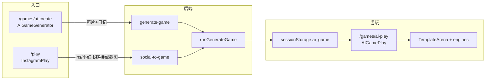

# Make a Game — 代码地图

Mnemo 项目中与 **「Make a game / AI 生成游戏」** 相关的全部代码、数据流与配置说明。

---

## 流程概览



### 两条主路径

| 路径 | 入口 | 用户操作 | Edge Function |
|------|------|----------|---------------|
| **A — AI Create** | `/games/ai-create` | 上传照片 + 写日记 | `generate-game` |
| **B — Scan & Play** | `/play` | 粘贴 Ins/小红书链接，或上传截图 | `social-to-game` |

两条路径最终都调用 `_shared/generateGame.ts` 中的 `runGenerateGame()`，结果写入 `sessionStorage.ai_game`，再跳转 `/games/ai-play` 游玩。

---

## 1. 路由与入口页

| 文件 | 路由 | 作用 |
|------|------|------|
| `src/App.tsx` | `/play`, `/games/ai-create`, `/games/ai-play` | 路由注册 |
| `src/pages/AIGameGenerator.tsx` | `/games/ai-create` | **主入口**：上传照片 + 写日记 → 调用 `generate-game` |
| `src/pages/InstagramPlay.tsx` | `/play` | **扫码/链接入口**：Ins / 小红书链接或截图 → 调用 `social-to-game` |
| `src/pages/AIGamePlay.tsx` | `/games/ai-play` | 从 `sessionStorage` 读取 spec，渲染游戏 |
| `src/pages/Index.tsx` | — | 首页「Make a game」CTA |
| `src/pages/JoinGame.tsx` | — | 游戏入口列表（含 AI Create） |
| `src/components/SiteShell.tsx` | — | 导航「AI Create」「Make a game」 |

### 线上 URL

- AI Create：https://mnemo-games.vercel.app/games/ai-create
- Scan & Play：https://mnemo-games.vercel.app/play
- 本地开发：http://localhost:8081（Vite 端口 8081）

---

## 2. 前端 UI 组件

| 文件 | 作用 |
|------|------|
| `src/components/GameGeneratingOverlay.tsx` | 生成中全屏 loading（进度条 + 阶段文案，约 12–25 秒） |
| `src/components/PlayQrCode.tsx` | `/play` 页二维码（客户端 `qrcode` 库生成，避免外部 API + localhost 问题） |
| `src/components/PlayDanmaku.tsx` | `/play` 页弹幕（Supabase Realtime INSERT 订阅 + 底部输入栏） |
| `src/components/riso/PageHeader.tsx` | `/play` 页头 |

> **说明**：`src/components/DiaryPhotoUpload.tsx` 主要用于档案页 `ArchiveCreate`，**不直接参与** AI Create 上传 UI（`AIGameGenerator` 内联实现了拍立得上传）。但 `autoArchiveFromAiCreate()` 会复用其 `DiaryPhoto` 类型。

---

## 3. 前端工具库

| 文件 | 作用 |
|------|------|
| `src/lib/compressImageForAi.ts` | 压缩图片再发给 AI（`compressImageForAi` / `compressPhotosForAi`，最大边 640px） |
| `src/lib/pickTemplateFromHint.ts` | 根据日记关键词在前端预选 48 个模板之一（`suggestedTemplateId`） |
| `src/lib/extractSocialUrl.ts` | 从粘贴文本中检测并提取 Ins / 小红书 URL |
| `src/lib/publicPlayUrl.ts` | QR 码指向生产 URL（本地 dev 时 QR 仍指向 prod，便于现场演示） |
| `src/lib/autoArchive.ts` | `autoArchiveFromAiCreate()` — 生成成功后自动建档（登录用户） |
| `src/lib/gameRoom.ts` | 多人房间（与 AI 生成弱相关，Print 版联机用） |

---

## 4. 游戏模板系统（48 模板 + 引擎）

### 核心文件

| 文件 | 作用 |
|------|------|
| `src/games/templates/catalog.ts` | **模板目录**（48 个）、`getTemplate()`、`resolveSpec()` |
| `src/games/templates/types.ts` | `GameTemplateId`、`AIGameTemplateSpec`、引擎类型枚举 |
| `src/games/templates/textDefaults.ts` | 文字类模板默认题面 |
| `src/games/templates/TemplateArena.tsx` | 按 `engine` 字段分发到具体引擎组件 |
| `src/games/AIGameArena.tsx` | `TemplateArena` 的别名导出（兼容旧引用） |

### 引擎实现

| 文件 | 引擎类型 |
|------|----------|
| `src/games/templates/engines/FallingEngine.tsx` | `falling_catch` / `falling_swarm` / `falling_tap_clear` |
| `src/games/templates/engines/AltEngines.tsx` | `hold_crosswalk`、`drag_jar`、`lanes_vertical`、`shutter_snap`、`swipe_wind`、`rhythm_tap`、`tram_sides`、`photo_pop` |
| `src/games/templates/engines/TextEngines.tsx` | `text_quiz`、`text_fill`、`text_order`、`text_choice` |
| `src/games/templates/engines/shared.tsx` | 引擎共用 UI / 逻辑 |

### 模板选择逻辑

1. **前端**：`pickTemplateFromHint(hint)` 对 48 个模板做关键词打分 → `suggestedTemplateId`
2. **后端**：`runGenerateGame()` 收到 `suggestedTemplateId` 后，LLM **定制**标题、emoji、背景、指令、文字题
3. **Vision**：仅当 hint 少于 40 字且无 `suggestedTemplateId` 时，或 `/play` 路径 `forceVision: true` 时，才读图

前后端模板 ID 列表需保持同步：

- 前端：`src/games/templates/catalog.ts`
- 后端：`supabase/functions/_shared/generateGame.ts` 中的 `TEMPLATE_IDS`

### 旧版独立游戏（Print Edition，非 AI 模板流）

同属「玩游戏」模块，但不走 AI 生成 pipeline：

- `src/games/TramCollector.tsx`
- `src/games/MotorbikeWeave.tsx`
- `src/games/CrosswalkDodge.tsx`
- `src/games/FireflyRPG.tsx`
- `src/games/PopBurst.tsx`
- `src/games/GameHUD.tsx`
- `src/games/GameCountdown.tsx`
- `src/games/gameUtils.ts`
- `src/games/useGameLoop.ts`
- `src/games/types.ts`
- `src/pages/BugGame.tsx`

---

## 5. Supabase Edge Functions（后端）

| 文件 | 作用 |
|------|------|
| `supabase/functions/generate-game/index.ts` | **AI Create 入口**：接收 `photos` + `hint` + `suggestedTemplateId` |
| `supabase/functions/social-to-game/index.ts` | **/play 入口**：解析社交链接 → 预览 → 生成 |
| `supabase/functions/instagram-to-game/index.ts` | 兼容包装，转发到 `social-to-game` |
| `supabase/functions/_shared/generateGame.ts` | **核心**：`runGenerateGame()` — LLM 选模板 / 定制内容 / 可选 vision |
| `supabase/functions/_shared/pickTemplateHint.ts` | 服务端模板关键词匹配 |
| `supabase/functions/_shared/llm.ts` | Moonshot LLM 调用（`callToolCompletion`） |
| `supabase/functions/_shared/socialPreview.ts` | 统一社交预览（Ins oEmbed + 小红书） |
| `supabase/functions/_shared/instagramOembed.ts` | Instagram oEmbed 拉取 |
| `supabase/functions/_shared/xiaohongshuPreview.ts` | 小红书页面解析（服务端可能被反爬，故 /play 有截图 fallback） |
| `supabase/functions/_shared/socialTypes.ts` | 社交预览类型定义 |
| `supabase/functions/_shared/cors.ts` | CORS 响应头 |

### 配置（`supabase/config.toml`）

以下 function 均 `verify_jwt = false`，便于 `/play` 免登录使用：

- `[functions.generate-game]`
- `[functions.social-to-game]`
- `[functions.instagram-to-game]`

---

## 6. 数据与弹幕

| 文件 | 作用 |
|------|------|
| `supabase/migrations/20250604140000_play_danmaku.sql` | `play_danmaku` 表（Realtime 弹幕） |
| `src/integrations/supabase/types.ts` | `play_danmaku` TypeScript 类型 |

---

## 7. 关键数据流

### 路径 A — AI Create（`/games/ai-create`）

```
用户上传照片 + 写日记
  → compressPhotosForAi()           // 压缩图片
  → pickTemplateFromHint(hint)      // 前端预选模板
  → supabase.functions.invoke("generate-game", { photos, hint, suggestedTemplateId })
  → runGenerateGame()               // LLM 定制游戏 spec
  → sessionStorage.setItem("ai_game", JSON.stringify(result))
  → navigate("/games/ai-play")
  → resolveSpec(parsed)             // 解析为 AIGameTemplateSpec
  → <TemplateArena spec={spec} />
  → autoArchiveFromAiCreate()       // 可选：登录用户自动建档
```

### 路径 B — Scan & Play（`/play`）

```
用户粘贴 Ins/小红书链接（或上传截图）
  → extractSocialUrl(text)          // 提取 URL
  → supabase.functions.invoke("social-to-game", { url })  // 或截图走 generate-game
  → fetchSocialPreview(url)         // oEmbed / 小红书解析 → caption + photoDataUrl
  → runGenerateGame({ photos, hint, forceVision: true })
  → sessionStorage.setItem("ai_game", ...) + source 标记
  → navigate("/games/ai-play")
  → <TemplateArena />
```

### sessionStorage 键

| 键 | 内容 |
|----|------|
| `ai_game` | 完整游戏 spec JSON（含 `templateId`、`title`、`engine` 等） |
| `ai_game_source` | 来源标记：`instagram` / `xiaohongshu` / `screenshot`（/play 路径） |

`AIGamePlay` 若无 `ai_game` 会重定向回 `/play` 或 `/games/ai-create`（取决于 source）。

---

## 8. 环境依赖

### 前端（`.env`）

```
VITE_SUPABASE_URL=
VITE_SUPABASE_PUBLISHABLE_KEY=
```

### Supabase Secrets

```
moonshot_api_key    # Moonshot LLM API Key（小写，通过 supabase secrets set）
```

### 部署

- **Vercel**：前端静态站，`mnemo-games.vercel.app` / `mnemo.games`
- **Supabase Edge Functions**：`generate-game`、`social-to-game` 等需单独 deploy
- **本地**：`npm run dev` → http://localhost:8081

---

## 9. 相关文档

| 文件 | 内容 |
|------|------|
| `docs/PLAY_QR_ZH.md` | 现场扫码 `/play` 使用说明 |
| `docs/TWIN_SETUP_ZH.md` | Twin / 分身与 AI Create 联动 |
| `DESIGN.md` | 「Make a game」按钮等 Riso 设计规范 |

---

## 10. 快速定位清单

若只需改某一环节，优先看这些文件：

| 想改什么 | 看哪里 |
|----------|--------|
| Make a game 主 UI | `src/pages/AIGameGenerator.tsx` |
| /play 扫码流 | `src/pages/InstagramPlay.tsx` |
| AI 生成逻辑 | `supabase/functions/_shared/generateGame.ts` |
| 模板列表 / 新增模板 | `src/games/templates/catalog.ts` + 后端 `TEMPLATE_IDS` |
| 游戏玩法 / 引擎 | `src/games/templates/engines/*.tsx` |
| 游玩页 / 结算 | `src/pages/AIGamePlay.tsx` |
| 生成 loading UX | `src/components/GameGeneratingOverlay.tsx` |
| 图片压缩 | `src/lib/compressImageForAi.ts` |
| 关键词 → 模板 | `src/lib/pickTemplateFromHint.ts` |
| 社交链接解析 | `src/lib/extractSocialUrl.ts` + `_shared/socialPreview.ts` |
| 自动建档 | `src/lib/autoArchive.ts` |
| 弹幕 | `src/components/PlayDanmaku.tsx` + migration SQL |

---

## 11. 生成耗时参考

| 阶段 | 典型耗时 |
|------|----------|
| 图片压缩 | < 1s |
| 上传 + LLM 调用 | 10–20s |
| 文字题定制 | +2–5s |
| Vision（读图） | +5–10s |
| **总计** | **约 12–25 秒**（网络与照片大小影响较大） |

---

*最后更新：2025-06-02*
